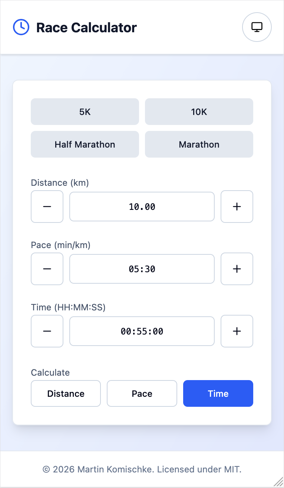
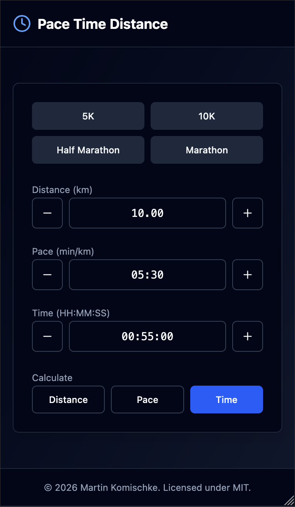

# Race Calculator

Fast, friendly, race-ready.

Static website for pace/time/distance calculations.

- Built with [React](https://react.dev/), [shadcn-ui](https://ui.shadcn.com/), and [Tailwind CSS](https://tailwindcss.com/).
- Local development: [Vite](https://vite.dev/).
- Theming: bright, dark, system.
- Live: [GitHub Pages](https://makomweb.github.io/racecalc).

Screenshots:

<table>
	<tr>
		<td><a href="./images/bright.png"></a></td>
		<td><a href="./images/dark.png"></a></td>
	</tr>
</table>

Quick start:

```bash
npm install
npm run dev
```
